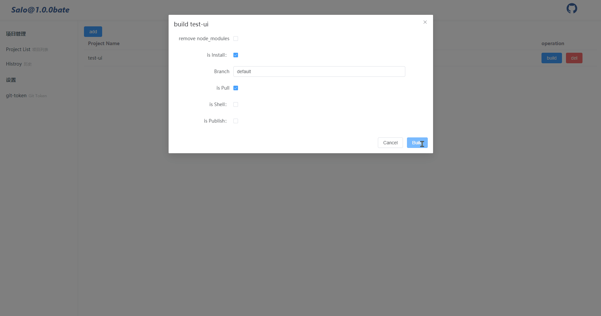
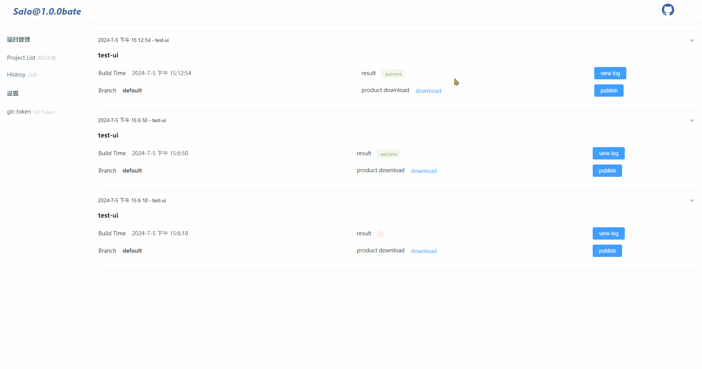

  

  Node 14 +
  Vue 3.3.4
  Element Plus 2.7 +

## 简介
SaIo是一款专注于前端打包的IO流项目，前端使用 Vue3 + Element Plus，后端使用 Node + Express + ChildProcess，简单易用，赏心悦目！！

## 特性

- 🆒 UI使用 **Vue3** 主流最新技术栈: `Vue3`
- 🍇 使用 **node**框架: `Express`，优雅、轻量、易用
- ⚡️ 开箱即用，`window`和`linux`均支持运行
- 🤹 基于`child_process`，自定义打包工作流，支持多线程打包，支持自定义`shell`脚本
- 🎨 使用 `Element Plus`，极致简洁的代码风格和清爽的页面设计，审美在线
- 🚀 使用 `scp2 + ssh2`, 实现一键打包推送至目标服务器，方便又易懂 
- 🍒 `独特的路由设定`，自定义路由，利用`window.location`特性，实现部分`router`功能

## 极简的UI

## 版权说明

本项目使用 `MIT协议`，默认授权给任何人，被授权人可免费地无限制的使用、复制、修改、合并、发布、发行、再许可、售卖本软件拷贝、并有权向被供应人授予同等的权利，但必须满足以下条件:

- 复制、修改和发行本项目代码需包含原作者的版权及许可信息，包括但不限于文件头注释、协议等
